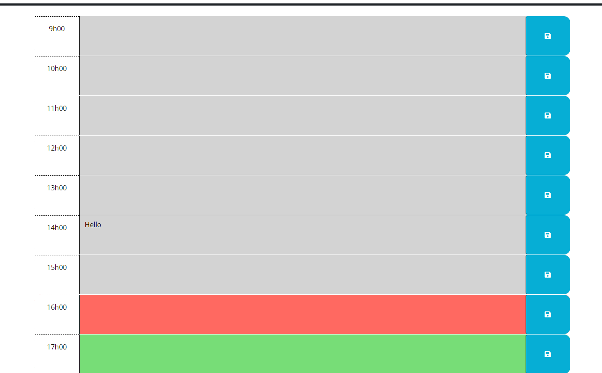

# CalendarApplication

## Description

This is my 5th project in this class. We had to do a daily calendar, that store information for each and every hour of office. 

## Usage

My URL to the application.
https://valerigionetnoel.github.io/CalendarApplication/

To use this daily calendar, simply type in your appointment at the desired hour, and click on the save button on the right. Once you refresh the page, it's going to stay there.

## Feature

This calendar change color depending on the hour of the day. It will also save in local storage your appointment.

## Photo

## License

Refer to the LICENSE.